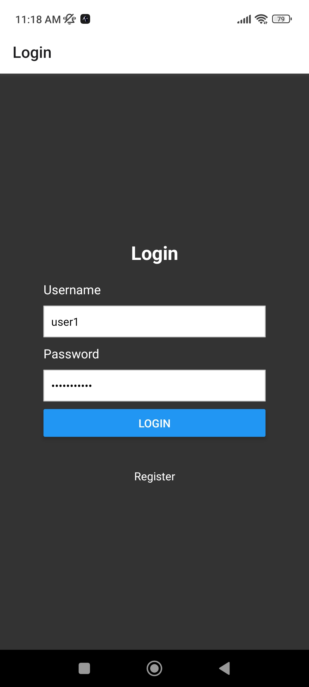
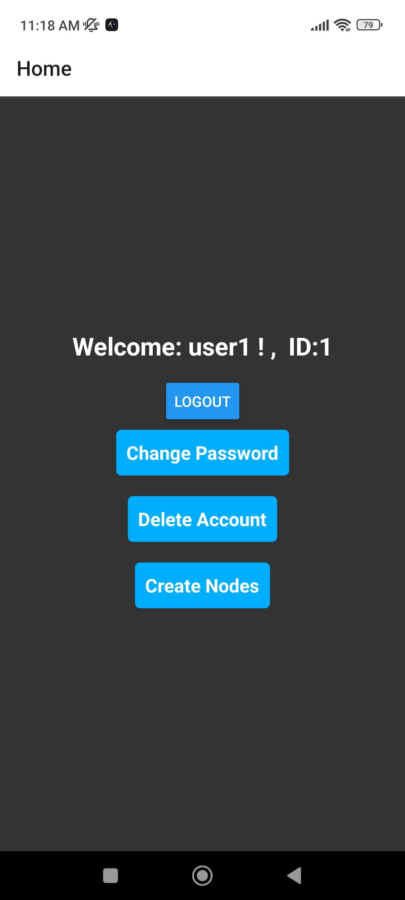
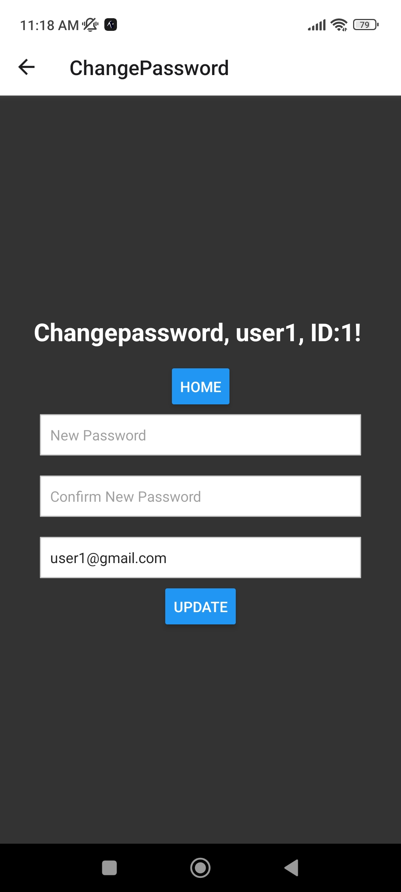
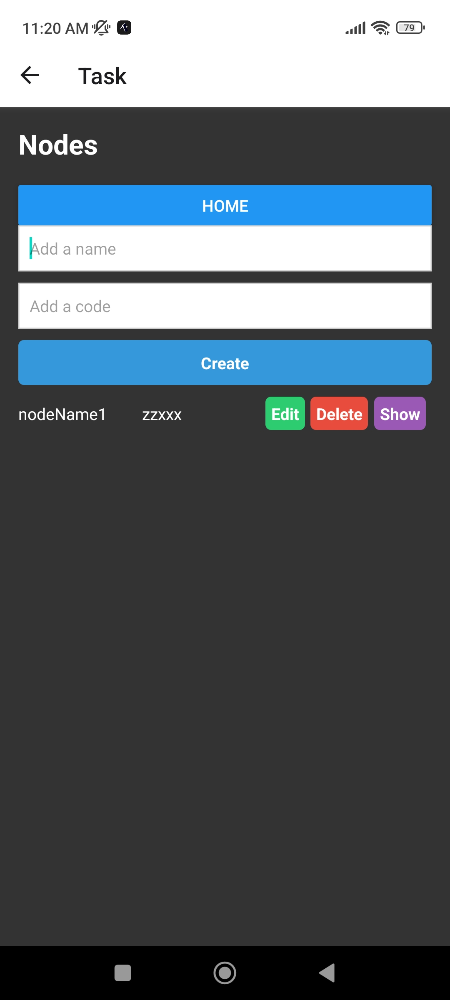
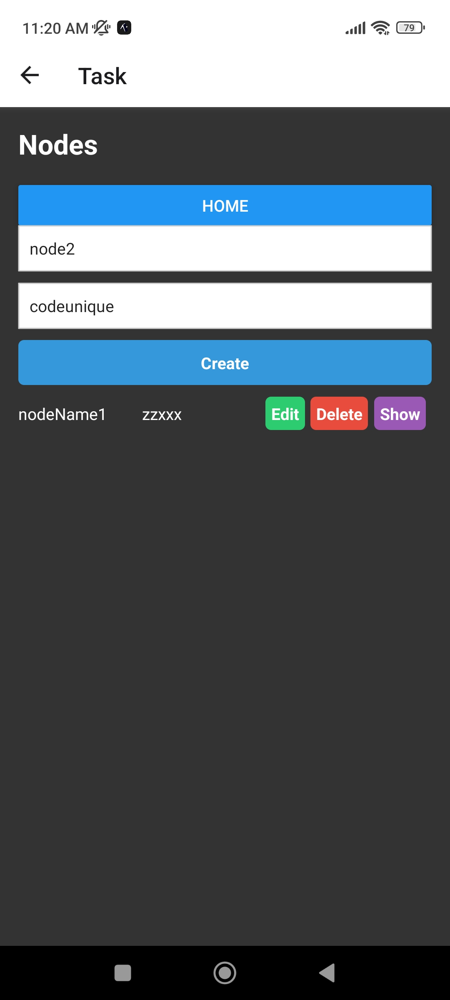
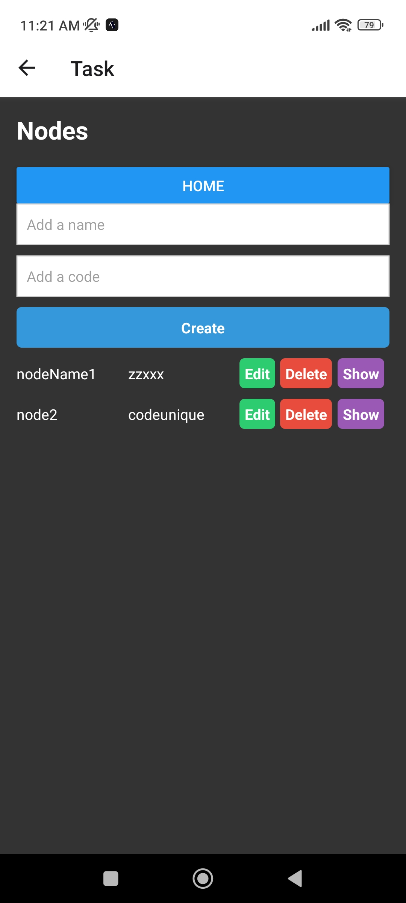

# IOT Flask and React Native with Login create nodes
<p align="justify">
IOT Flask REST API with sqlalchemy mysql where there is a login and register (you can change password and email, delete account) where each user can create his own node by giving the unique device code and name, the data is displayed in a table and line graph. (the operation of creating nodes in the database, each node has its own table).Using React Native
</p>

<p align="center">
  
</p>

___

<p align="justify">
First create an account where you must create a username, password ("Must include at least one number.", "Must include at least one lowercase letter,"Must include at least one lowercase letter.", "Must include at least one uppercase letter.", "Must include at least one uppercase letter.","Must include at least one uppercase letter.", "Must include at least one uppercase letter.", "Must include at least one uppercase letter.","Must include at least one special character.", "Must include at least one special character.", "Must include at least one special character.","The length of the password must be equal to or greater than 8 characters.","Must not contain blank spaces.") Confirm your password and enter an email address.
</p>

<p align="center">
  
</p>

<p align="justify">
In login enter your username and password, click on the "Login" button.
</p>

<p align="center">
  
</p>

<p align="justify">

After logging in you will see the home screen where you will see your user name and registration id, in this section you can log out, change your password, delete your account (delete your account and node), and create a new nodes.
</p>

<p align="center">
  
</p>

<p align="justify">

In change password you can change your password and email if required.
</p>

<p align="center">
  
</p>

<p align="justify">
In create nodes , insert a name and the unique code to create the node and the 'home' button returns to the home page.
</p>

<p align="center">
  
</p>

<p align="justify">
Insert a name and the unique code to create the node and click button "Create"
</p>

<p align="center">
  
</p>

<p align="center">
  
</p>


<p align="justify">
By clicking on "edit" you can modify the name given to the node, and by clicking on "update" you confirm it and the "Cancel Edit" button cancels the edition or modification.
</p>

<p align="center">
  
</p>
<p align="center">
  
</p>


<p align="justify">
When you click on "Show" it shows the IOT device data that is being obtained in this case temperature and humidity if the device is not sending the data to 'http://localhost/tablecode/(code)' nothing will appear but if it is sending the data, the data will appear. for example in this case the code is codigo1 then it would be http://localhost/tablecode/zzxxx. 

<p align="justify">
When you click on "Show" it shows the data of the IOT device that is being obtained in this case of temperature and humidity, these data are displayed in a table where you can see the 5 rows of data, to see the other data there is the "NEXT" button where it shows the next data (in 5 rows) and to go back there is the "PREVIOUS" button that goes back to the data seen until you reach the first data displayed. The data is also displayed graphically with a line graph where the temperature data is the red line and the humidity data is the blue line, where the x-axis is the id of the data and the y-axis is the value of the data.
</p>
<p align="center">
  
</p>
___

## Steps to implement it
Backend Options for do it: 

1. Use Dockerfile or docker-compose.yml
2. Use virtual enviroments and apply  requirements.txt 
```python
pip install -r requirements.txt
```
Use Docker 
```python
#Comands for use docker container mysql
docker run --name mymysql -e MYSQL_ROOT_PASSWORD=mypassword -p 3306:3306 -d mysql:latest

docker exec -it mymysql bash

#Inside of the container mysql
mysql -u root -p

create database flaskmysql;

```
Fronted React Native :
1. Use of expo
```python
#Download expo
npm install -g expo-cli

#Create project expo
expo init name-project
#example
expo init fronted-react-native #example

#Instalation libraries of this project(package.json)
npm install @react-native-async-storage/async-storage

npm install @react-navigation/native react-native-reanimated react-native-gesture-handler react-native-screens react-native-safe-area-context @react-native-community/masked-view react-navigation-stack

npm install react-native-dotenv

npm install @react-navigation/native @react-navigation/stack react-native-reanimated

#For Graph
npm install react-native-chart-kit

npx expo install react-native-svg

#Change .env
API_URL=<IP_BACKEND>
#examle API_URL=http://192.*.*.*:5000
```
___

The code for sending REST data from an IOT device, for example in this case using an ESP32 is in :
[Code IOT ESP32 REST]( https://github.com/diegoperea20/IoT_-internet_of_things-/blob/main/tercer_corte/Taller_6/taller_6_rest/src/main.cpp)

 https://github.com/diegoperea20/IoT_-internet_of_things-/blob/main/tercer_corte/Taller_6/taller_6_rest/src/main.cpp